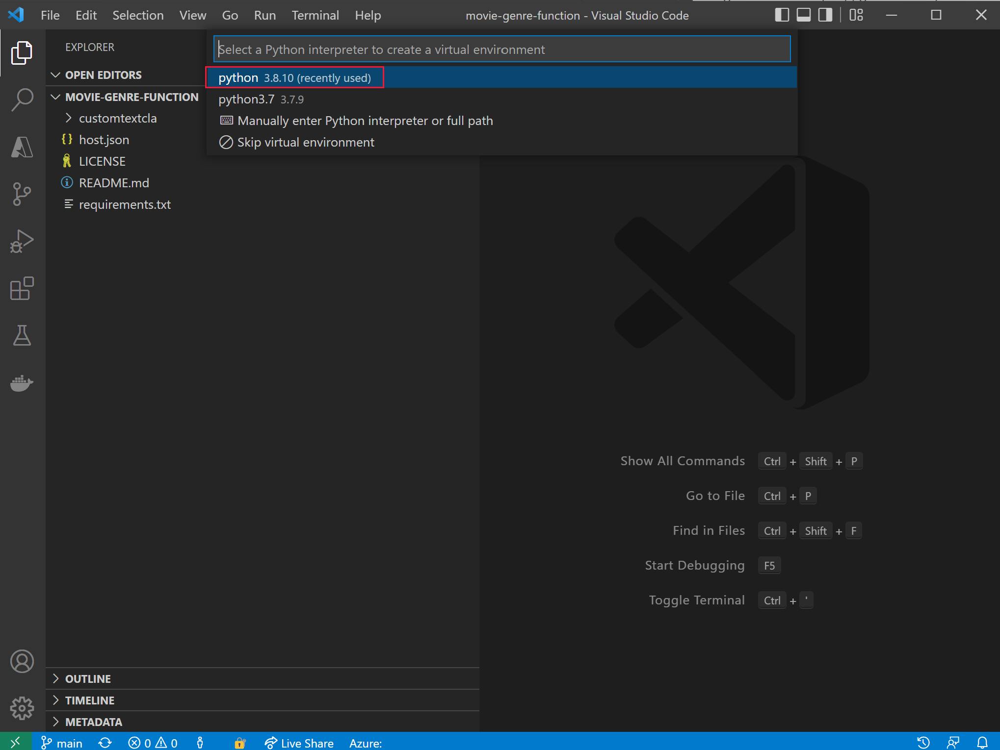
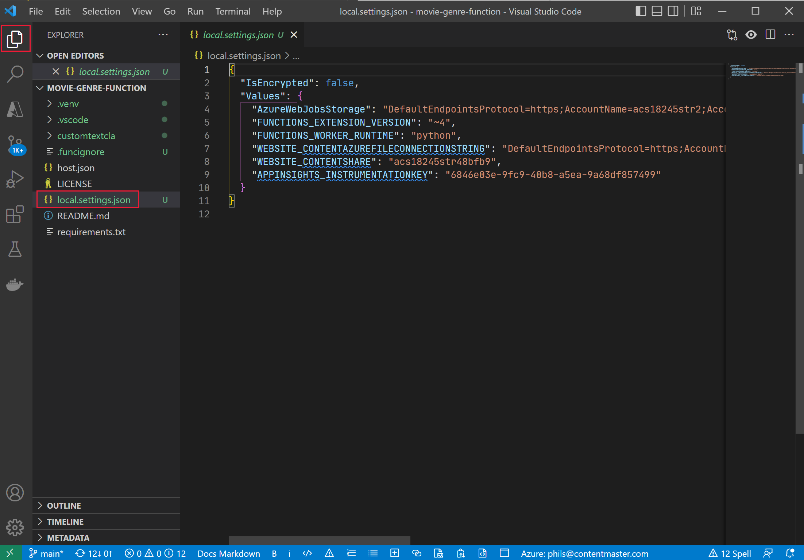

---
lab:
  title: Arricchire un indice di ricerca IA con classi personalizzate
---

# Arricchire un indice di ricerca IA con classi personalizzate

È stata creata una soluzione di ricerca e ora si vogliono aggiunger Servizi di Azure AI per gli arricchimenti linguistici per gli indici.

In questo esercizio si creerà una soluzione di Azure AI Search e si arricchirà un indice con i risultati di un progetto di classificazione personalizzata del testo di Language Studio. Si creerà un'app per le funzioni per connettere la ricerca e il modello di classificazione.

> **Nota** Per completare questo esercizio, sarà necessaria una sottoscrizione di Microsoft Azure. Se non è ancora disponibile alcuna sottoscrizione, è possibile registrarsi per una valutazione gratuita all'indirizzo [https://azure.com/free](https://azure.com/free?azure-portal=true).

## Configurare l'ambiente di sviluppo con Python, VS Code e le estensioni di VS Code

Per completare l'esercizio, installare questi strumenti. È comunque possibile seguire i passaggi senza questi strumenti.

1. Installare [VS Code](https://code.visualstudio.com/)
1. Installare [Azure Functions Core Tools](https://github.com/Azure/azure-functions-core-tools)
1. Installare le [estensioni degli strumenti di Azure per VS Code](https://code.visualstudio.com/docs/azure/extensions)
1. Installare [Python 3.8](https://www.python.org/downloads/release/python-380/) per il sistema operativo in uso.
1. Installare l'[estensione Python per VS Code](https://marketplace.visualstudio.com/items?itemName=ms-python.python)

## Configurare le risorse di Azure

Per risparmiare tempo, selezionare questo modello di Azure Resource Manager per creare le risorse che saranno necessarie più avanti nell'esercizio.

### Distribuire un modello di ARM predefinito

1. [](https://portal.azure.com/#create/Microsoft.Template/uri/https%3A%2F%2Fraw.githubusercontent.com%2FMicrosoftLearning%2Fmslearn-knowledge-mining%2Fmain%2FLabfiles%2F04-enrich-custom-classes%2Fazuredeploy.json) selezionare questo collegamento per creare le risorse iniziali. Potrebbe essere necessario copiare e incollare il [collegamento diretto](https://portal.azure.com/#create/Microsoft.Template/uri/https%3A%2F%2Fraw.githubusercontent.com%2FMicrosoftLearning%2Fmslearn-knowledge-mining%2Fmain%2FLabfiles%2F04-enrich-custom-classes%2Fazuredeploy.json) nella barra di ricerca.

    
1. In **Gruppo di risorse** selezionare **Crea nuovo** e assegnare il nome **cog-search-language-exe**.
1. In **Area** selezionare un'[area supportata](https://learn.microsoft.com/azure/ai-services/language-service/concepts/regional-support) nelle vicinanze.
1. Il valore di **Prefisso della risorsa** deve essere univoco a livello globale: immettere un prefisso casuale con caratteri minuscoli e numeri, ad esempio **acs18245**.
1. In **Località** selezionare la stessa area scelta in precedenza.
1. Selezionare **Rivedi e crea**.
1. Seleziona **Crea**.

    > **Nota** Verrà visualizzato il messaggio **Per creare questa risorsa, accettare le condizioni per l'utilizzo del servizio riportate sotto.** Selezionando **Crea** si accettano le condizioni.

1. Selezionare **Vai al gruppo di risorse** per visualizzare tutte le risorse create.

    
Si configurerà un indice di Ricerca cognitiva di Azure, si creerà una funzione di Azure e si creerà un progetto di Language Studio per identificare i generi dei film in base alla trama.

### Caricare dati di esempio per il training dei servizi di linguaggio

Questo esercizio usa 210 file di testo che contengono trame di film. Il nome dei file di testo corrisponde al titolo del film. La cartella contiene anche un file **movieLabels.json** che esegue il mapping dei generi di un film al file e per ogni file è presente una voce JSON simile alla seguente:

```json
{
    "location": "And_Justice_for_All.txt",
    "language": "en-us",
    "classifiers": [
        {
            "classifierName": "Mystery"
        },
        {
            "classifierName": "Drama"
        },
        {
            "classifierName": "Thriller"
        },
        {
            "classifierName": "Comedy"
        }
    ]
},
```

1. Passare a **Labfiles/04-enrich-custom-classes** ed estrarre la cartella **film summary.zip** contenente tutti i file.

    > **Nota** Questi file vengono usati per eseguire il training di un modello in Language Studio e verranno anche indicizzati in Azure AI Search.

1. Nel [portale di Azure](https://portal.azure.com/) selezionare **Gruppi di risorse** e quindi il proprio gruppo di risorse.
1. Selezionare l'account di archiviazione creato, ad esempio **acs18245str**.
1. Selezionare **Configurazione** nel riquadro sinistro, selezionare l'opzione **Abilita** per l'impostazione *Consenti accesso anonimo ai BLOB* e quindi selezionare **Salva** nella parte superiore della pagina.

    

1. Selezionare **Contenitori** a sinistra e quindi selezionare **+ Contenitore**.
1. Nel riquadro **Nuovo contenitore** in **Nome** immettere **language-studio-training-data**.
1. In **Livello di accesso anonimo** scegliere **Contenitore (accesso in lettura anonimo per contenitori e BLOB)** e selezionare **Crea**.
1. Selezionare il nuovo contenitore appena creato, **language-studio-training-data**.
    
1. Selezionare **Carica** nella parte superiore del riquadro.
1. Nel riquadro **Carica BLOB** selezionare **Cerca file**.
1. Passare alla posizione in cui sono stati estratti i file di esempio e selezionare tutti i file di testo (`.txt`) e JSON (`.json`).
1. Selezionare **Carica** nel riquadro.
1. Chiudere il riquadro **Carica BLOB**.

### Creare una risorsa Lingua

1. Nel collegamento di navigazione nella parte superiore della pagina selezionare **Home**.
1. Seleziona re **+ Crea una risorsa** e cercare *Servizio Lingua*.
1. Selezionare **Crea** in **Servizio Lingua**.
1. Selezionare l'opzione che include **Classificazione personalizzata del testo e Riconoscimento entità denominata personalizzata**.
1. Selezionare **Continua a creare la risorsa**.
1. In **Gruppo di risorse** scegliere **cog-search-language-exe**.
1. In **Area** selezionare l'area usata in precedenza.
1. In **Nome** immettere **learn-language-service-for-custom-text**. Deve essere univoco a livello globale, quindi potrebbe essere necessario aggiungere numeri o caratteri casuali alla fine di esso.
1. In **Piano tariffario** selezionare **S**.
1. In **Account di archiviazione nuovo/esistente** selezionare **Account di archiviazione esistente**.
1. In **Account di archiviazione nella sottoscrizione selezionata corrente e nell'area della risorsa** selezionare l'account di archiviazione creato, ad esempio **acs18245str**.
1. Accettare le condizioni in **Informativa Intelligenza artificiale responsabile** e quindi selezionare **Rivedi e crea**.
1. Seleziona **Crea**.
1. Attendere la distribuzione delle risorse e quindi selezionare **Vai al gruppo di risorse**.
1. Selezionare **learn-language-service-for-custom-text**.

    
1. Scorrere verso il basso nel riquadro **Panoramica** e selezionare **Introduzione a Language Studio**.
1. Accedere a Language Studio. Se viene richiesto di scegliere una risorsa Lingua, selezionare la risorsa creata in precedenza.

### Creare un progetto di classificazione personalizzata del testo in Language Studio

1. Nella home page di Language Studio selezionare **Crea nuovo** e quindi selezionare **Classificazione personalizzata del testo**.

    

1. Selezionare **Avanti**.

    
1. Selezionare **Classificazione con più etichette** e quindi **Avanti**.

    

1. In **Nome** immettere **movie-genre-classifier**.
1. In **Lingua principale testo** selezionare **Inglese (Stati Uniti)**.
1. In **Descrizione** immettere **A model that can identify a movie genre from the summary**.
1. Selezionare **Sì, abilita il set di dati multilingue**.
1. Selezionare **Avanti**.

    

1. In **Contenitore di Archiviazione BLOB** scegliere **language-studio-training-data**.
1. Selezionare **Sì, i documenti sono già etichettati ed è disponibile un file di etichette JSON nel formato corretto**.
1. In **Documenti etichette** scegliere **movieLabels**.
1. Selezionare **Avanti**.
1. Seleziona **Crea progetto**.

### Eseguire il training di un modello di intelligenza artificiale di classificazione personalizzata del testo

1. A sinistra selezionare **Processi di training**.

    

1. Selezionare **+ Avvia un processo di training**.

    
1. In **Esegui il training di un nuovo modello** immettere **movie-genre-classifier**.
1. Seleziona **Esegui il training**.
1. Il training del modello di classificatore richiederà meno di 10 minuti. Attendere che lo stato cambi in **Training completato**.

### Distribuire il modello di intelligenza artificiale di classificazione personalizzata del testo

1. A sinistra selezionare **Distribuzione di un modello**.

    
1. Selezionare **Aggiungi una distribuzione**.

    
1. In **Creare un nuovo nome di distribuzione** immettere **test-release**.
1. In **Modello** selezionare **movie-genre-classifier**.
1. Seleziona **Distribuisci**.

Lasciare aperta questa pagina Web che servirà più avanti in questo esercizio.

### Creare un indice di Azure AI Search

Creare un indice di ricerca che è possibile arricchire con questo modello: verranno indicizzati tutti i file di testo già scaricati che contengono le trame dei film.

1. Nel [portale di Azure](https://portal.azure.com/) selezionare **Gruppi di risorse**, selezionare il proprio gruppo di risorse e quindi selezionare l'account di archiviazione creato, ad esempio **acs18245str**.
1. Selezionare **Contenitori** a sinistra e quindi selezionare **+ Contenitore**.
1. Nel riquadro **Nuovo contenitore** in **Nome** immettere **search-data**.
1. In **Livello di accesso anonimo** scegliere **Contenitore**.
1. Seleziona **Crea**.
1. Selezionare il nuovo contenitore appena creato, **search-data**.
1. Selezionare **Carica** nella parte superiore del riquadro.
1. Nel riquadro **Carica BLOB** selezionare **Cerca file**.
1. Passare alla posizione in cui sono stati scaricati i file di esempio e selezionare **SOLO** i file di testo (`.txt`).
1. Selezionare **Carica** nel riquadro.
1. Chiudere il riquadro **Carica BLOB**.

### Importare documenti in Azure AI Search

1. A sinistra selezionare **Gruppi di risorse**, selezionare il gruppo di risorse e quindi selezionare il servizio di ricerca.

1. Selezionare **Importa dati**.

    
1. In **Origine dati** selezionare **Archiviazione BLOB di Azure**.
1. In **Nome origine dati** immettere **movie-summaries**.
1. Selezionare **Scegliere una connessione esistente**, selezionare l'account di archiviazione e quindi selezionare il contenitore appena creato, **search-data**.
1. Selezionare **Aggiungi competenze cognitive (facoltativo)**.
1. Espandere la sezione **Collega servizi IA** e quindi selezionare il servizio Azure per intelligenza artificiale creato in precedenza.

    
1. Espandere la sezione **Aggiungi arricchimenti**.

    
1. Lasciare i valori predefiniti per tutti i campi e quindi selezionare **Estrai nomi di persone**.
1. Selezionare **Estrai frasi chiave**.
1. Selezionare **Rileva lingua**.
1. Selezionare **Avanti: Personalizza indice di destinazione**.

    
1. Lasciare i valori predefiniti per tutti i campi e per **metadata_storage_name** selezionare **Recuperabile** e **Ricercabile**.
1. Seleziona **Successivo: Crea un indicizzatore**.
1. Selezionare **Invia**.

L'indicizzatore verrà eseguito e creerà un indice dei 210 file di testo. Non è necessario attendere il completamento per continuare con i passaggi successivi.

## Creare un'app per le funzioni per arricchire l'indice di ricerca

Si creerà ora un'app per le funzioni Python che verrà chiamata dal set di competenze personalizzato di ricerca cognitiva. L'app per le funzioni userà il modello di classificatore di testo personalizzato per arricchire l'indice di ricerca.

1. [Scaricare i file necessari](https://github.com/MicrosoftLearning/mslearn-knowledge-mining/raw/main/Labfiles/04-enrich-custom-classes/movie-genre-function.zip) ed estrarre la cartella contenente tutti i file.
1. Aprire Visual Studio Code e aprire la cartella **movie-genre-function** appena scaricata.

    
1. Se sono state installate tutte le estensioni necessarie, verrà richiesto di ottimizzare il progetto. Selezionare **Sì**.
    
1. Selezionare l'interprete Python, che deve essere la versione 3.8.
1. L'area di lavoro verrà aggiornata. Se viene chiesto di effettuare la connessione alla cartella dell'area di lavoro, selezionare **Sì**.
1. Premere **F5** per eseguire il debug dell'app.

    
    Se l'app è in esecuzione, verrà visualizzato un URL localhost che è possibile usare per i test locali.

1. Arrestare il debug dell'app premendo **MAIUSC** + **F5**.

### Distribuire l'app per le funzioni locale in Azure

1. In Visual Studio Code premere **F1** per aprire il riquadro comandi.
1. Nel riquadro comandi cercare e selezionare `Azure Functions: Create Function App in Azure...`.
1. Immettere un nome univoco globale per l'app per le funzioni, ad esempio **acs13245str-function-app**.
1. In **Selezionare uno stack di runtime** selezionare **Python 3.8**.
1. Selezionare la stessa località usata in precedenza.

1. Nel riquadro di spostamento a sinistra selezionare l'estensione **Azure**.
    
1. Espandere **Risorse**, espandere **App per le funzioni** nella propria sottoscrizione, quindi fare clic con il pulsante destro del mouse sulla funzione, ad esempio **acs13245-function-app**.
1. Selezionare **Distribuisci in app per le funzioni**. Attendere la distribuzione dell'app.
1. Espandere l'app, fare clic con il pulsante destro del mouse su **Impostazioni applicazione** e scegliere **Scarica impostazioni remote**.
1. A sinistra selezionare **Explorer** e quindi **local.settings.json**.

    
L'app per le funzioni deve essere connessa al modello di classificazione personalizzata del testo. Seguire questa procedura per ottenere le impostazioni di configurazione.

1. Nel browser passare a **Language Studio**. Verrà visualizzata la pagina **Distribuzione di un modello**.

    
1. Selezionare il proprio modello. Quindi selezionare **Ottieni URL di stima**.
1. Selezionare l'icona per la copia accanto a **URL di stima**.
1. In Visual Studio Code, nella parte inferiore di **local.settings.json** incollare l'URL di stima.
1. In **Language Studio**, a sinistra, selezionare **Impostazioni del progetto**.

    
1. Selezionare l'icona per la copia accanto a **Chiave primaria**.
1. In Visual Studio Code, nella parte inferiore di **local.settings.json** incollare la chiave primaria.
1. Modificare le impostazioni per aggiungere queste quattro righe nella parte inferiore e copiare l'endpoint nel valore `TA_ENDPOINT`.

    ```json
    ,
    "TA_ENDPOINT": " [your endpoint] ",
    "TA_KEY": " [your key] ",
    "DEPLOYMENT": "test-release",
    "PROJECT_NAME": "movie-genre-classifier"
    ```

1. Copiare la chiave primaria nel valore `TA_KEY`.

    ```json
    {
      "IsEncrypted": false,
      "Values": {
        "AzureWebJobsStorage": "DefaultEndpointsProtocol=https;AccountName=...",
        "FUNCTIONS_EXTENSION_VERSION": "~4",
        "FUNCTIONS_WORKER_RUNTIME": "python",
        "WEBSITE_CONTENTAZUREFILECONNECTIONSTRING": "DefaultEndpointsProtocol=https;AccountName=...",
        "WEBSITE_CONTENTSHARE": "acs...",
        "APPINSIGHTS_INSTRUMENTATIONKEY": "6846...",
        "TA_ENDPOINT": "https://learn-languages-service-for-custom-text.cognitiveservices.azure.com/language/analyze-text/jobs?api-version=2022-05-01",
        "TA_KEY": "7105e938ce1...",
        "DEPLOYMENT": "test-release",
        "PROJECT_NAME": "movie-genre-classifier"
      }
    }

    ```

    Le impostazioni saranno simili a quelle indicate sopra, con i valori specifici del progetto.
 
1. Premere **CTRL**+**S** per salvare le modifiche a **local.settings.json**.
1. Nel riquadro di spostamento a sinistra selezionare l'estensione **Azure**.
1. Espandere **Risorse** e, nella propria sottoscrizione, espandere **App per le funzioni**, quindi fare clic con il pulsante destro del mouse su **Impostazioni applicazione** e scegliere **Carica impostazioni locali**.

### Testare l'app per le funzioni remota

È disponibile una query di esempio che è possibile usare per verificare che l'app per le funzioni e il modello di classificatore funzionino correttamente.

1. A sinistra selezionare **Esplora risorse**, espandere la cartella **customtextcla** e quindi selezionare **sample.dat**.

    
1. Copiare il contenuto del file.
1. A sinistra selezionare l'estensione **Azure**.

    
1. In **App per le funzioni** espandere **Funzioni**, fare clic con il pulsante destro del mouse su **customtextcla** e quindi scegliere **Esegui funzione ora**.
1. In **Immettere il corpo della richiesta** incollare i dati di esempio copiati e quindi premere **INVIO**.

    L'app per le funzioni risponderà con i risultati JSON.

1. Espandere la notifica per visualizzare l'intero risultato.

    
    La risposta JSON sarà simile alla seguente:

    ```json
    {"values": 
        [
            {"recordId": "0", 
            "data": {"text": 
            [
                {"category": "Action", "confidenceScore": 0.99}, 
                {"category": "Comedy", "confidenceScore": 0.96}
            ]}}
        ]
    }
    ```

### Aggiungere un campo all'indice di ricerca

È necessaria una posizione in cui archiviare l'arricchimento restituito dalla nuova app per le funzioni. Seguire questa procedura per aggiungere un nuovo campo composto per archiviare la classificazione del testo e il punteggio di attendibilità.

1. Nel [portale di Azure](https://portal.azure.com/) passare al gruppo di risorse che contiene il servizio di ricerca e quindi selezionare il servizio di ricerca cognitiva creato, ad esempio **acs18245-search-service**.
1. Nel riquadro **Panoramica** selezionare **Indici**.
1. Selezionare **azurebob-index**.
1. Selezionare **Modifica JSON**.
1. Aggiungere i nuovi campi all'indice, incollare il codice JSON seguente nel campo del contenuto.

    ```json
    {
      "name": "textclass",
      "type": "Collection(Edm.ComplexType)",
      "analyzer": null,
      "synonymMaps": [],
      "fields": [
        {
          "name": "category",
          "type": "Edm.String",
          "facetable": true,
          "filterable": true,
          "key": false,
          "retrievable": true,
          "searchable": true,
          "sortable": false,
          "analyzer": "standard.lucene",
          "indexAnalyzer": null,
          "searchAnalyzer": null,
          "synonymMaps": [],
          "fields": []
        },
        {
          "name": "confidenceScore",
          "type": "Edm.Double",
          "facetable": true,
          "filterable": true,
          "retrievable": true,
          "sortable": false,
          "analyzer": null,
          "indexAnalyzer": null,
          "searchAnalyzer": null,
          "synonymMaps": [],
          "fields": []
        }
      ]
    },
    ```

    L'indice sarà ora simile a quanto segue.

    
1. Seleziona **Salva**.

### Modificare il set di competenze personalizzato per chiamare l'app per le funzioni

L'indice di ricerca cognitiva richiede un modo per popolare i nuovi campi. Modificare il set di competenze creato in precedenza per chiamare l'app per le funzioni.

1. Nella parte superiore della pagina selezionare il collegamento del servizio di ricerca, ad esempio **acs18245-search-service | Indici**.

1. Nel riquadro **Panoramica** selezionare **Set di competenze**.

    
1. Selezionare **azureblob-skillset**.
1. Aggiungere la definizione di set di competenze personalizzata seguente, incollandola come primo set di competenze.

    ```json
    {
      "@odata.type": "#Microsoft.Skills.Custom.WebApiSkill",
      "name": "Genre Classification",
      "description": "Identify the genre of your movie from its summary",
      "context": "/document",
      "uri": "URI",
      "httpMethod": "POST",
      "timeout": "PT30S",
      "batchSize": 1,
      "degreeOfParallelism": 1,
      "inputs": [
        {
          "name": "lang",
          "source": "/document/language"
        },
        {
          "name": "text",
          "source": "/document/content"
        }
      ],
      "outputs": [
        {
          "name": "text",
          "targetName": "class"
        }
      ],
      "httpHeaders": {}
    },
    ```

È necessario modificare il valore di `"uri": "URI"` per puntare all'app per le funzioni.

1. In Visual Studio Code selezionare l'estensione **Azure**.

    
1. In **Funzioni** fare clic con il pulsante destro del mouse su **customtextcla** e quindi scegliere **Copia URL funzione**.
1. Nel portale di Azure sostituire l'URI con l'URL della funzione copiato. 
1. Seleziona **Salva**.

### Modificare i mapping dei campi nell'indicizzatore

A questo punto sono disponibili i campi per archiviare l'arricchimento e un set di competenze per chiamare l'app per le funzioni. L'ultimo passaggio consiste nell'indicare alla ricerca cognitiva dove inserire l'arricchimento.

1. Nella parte superiore della pagina selezionare il collegamento del servizio di ricerca, ad esempio **acs18245-search-service | Set di competenze**.

    
1. Nel riquadro **Panoramica** selezionare **Indicizzatori**.
1. Selezionare **azureblob-indexer**.
1. Selezionare **Definizione indicizzatore (JSON)**.
1. Aggiungere un nuovo mapping dei campi di output incollando questa definizione di campo all'inizio della sezione dei campi di output.

    ```json
    {
      "sourceFieldName": "/document/class",
      "targetFieldName": "textclass"
    },
    ```

    La definizione JSON dell'indicizzatore sarà ora simile alla seguente:

    
1. Seleziona **Salva**.
1. Selezionare **Reimposta** e quindi **Sì**.
1. Selezionare **Esegui** e quindi **Sì**.

    Il servizio di Ricerca cognitiva di Azure esegue l'indicizzatore aggiornato. L'indicizzatore usa il set di competenze personalizzato modificato. Il set di competenze chiama l'app per le funzioni con il documento che viene indicizzato. Il modello di classificatore di testo personalizzato usa il testo nel documento per provare a identificare il genere del film. Il modello restituisce un documento JSON con indicati i generi e i livelli di attendibilità. L'indicizzatore esegue il mapping dei risultati JSON ai campi nell'indice usando il nuovo mapping dei campi di output.

1. Selezionare **Storico esecuzione**.
1. Verificare che l'indicizzatore sia stato eseguito correttamente sui 210 documenti.

    
    Può essere necessario selezionare **Aggiorna** per aggiornare lo stato dell'indicizzatore.

## Testare l'indice di ricerca arricchito

1. Nella parte superiore della pagina selezionare il servizio di ricerca, ad esempio **acs18245-search-service | Indicizzatori**.

1. Nel riquadro **Panoramica** selezionare **Indici**.
1. Selezionare **azurebob-index**.

    
1. Seleziona **Cerca**.
1. Esplorare i risultati della ricerca.

Ogni documento nell'indice deve avere un nuovo campo `textclass` in cui è possibile eseguire ricerche. Contiene un campo relativo alla categoria con i generi dei film. I generi possono essere più di uno. Viene indicato anche il livello di attendibilità di identificazione del genere con il modello di classificazione personalizzata del testo.

Dopo aver completato l'esercizio, eliminare tutte le risorse non più necessarie.

### Eliminare le risorse dell'esercizio

1. Nel portale di Azure passare alla home page e selezionare **Gruppi di risorse**.
1. Selezionare i gruppi di risorse non necessari e quindi selezionare **Elimina gruppo di risorse**.
