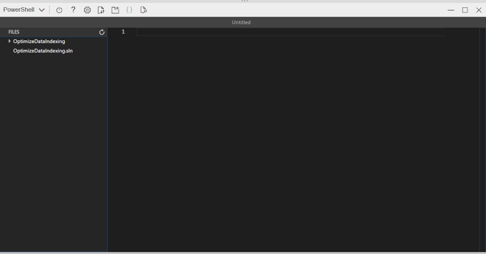
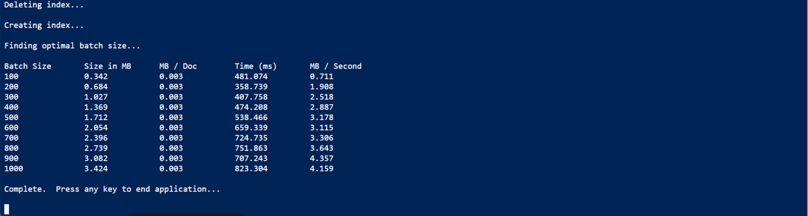
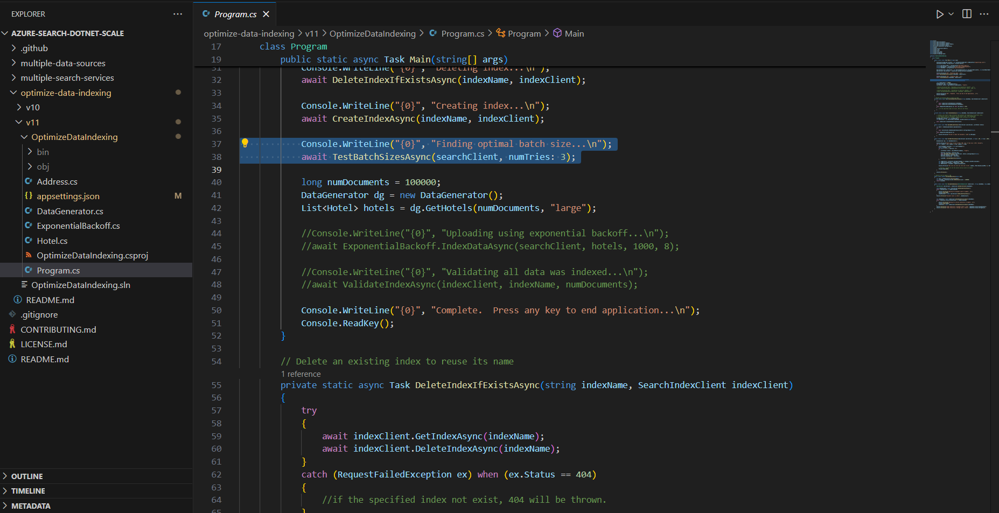
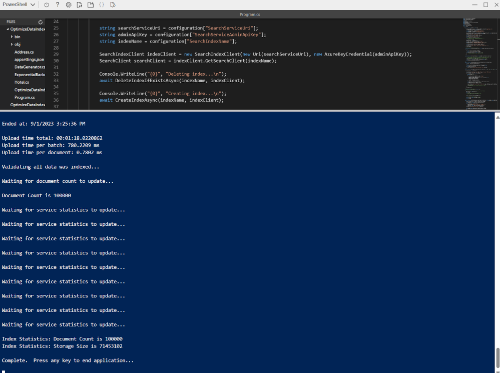
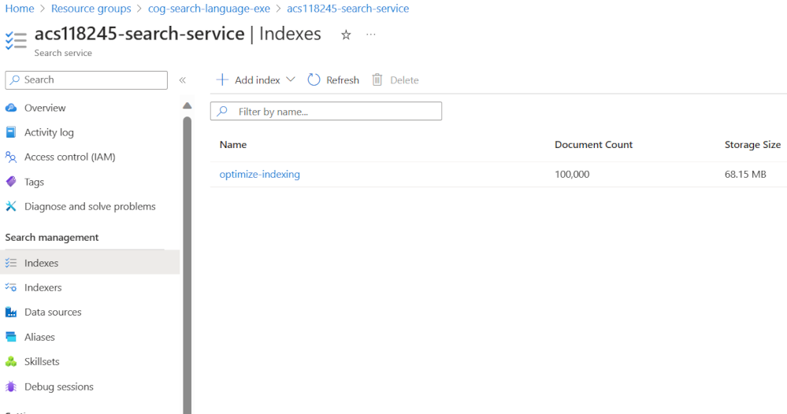

---
lab:
  title: Aggiungere elementi a un indice usando l'API push
---

# Aggiungere elementi a un indice usando l'API push

Si vuole esplorare come creare un indice di Azure AI Search e caricare documenti in tale indice usando il codice C#.

In questo esercizio si clonerà una soluzione C# esistente e la si eseguirà per determinare le dimensioni ottimali del batch per il caricamento di documenti. Si useranno quindi tali dimensioni del batch e si caricheranno i documenti in modo efficace usando un approccio in thread.

> **Nota** Per completare questo esercizio, sarà necessaria una sottoscrizione di Microsoft Azure. Se non è ancora disponibile alcuna sottoscrizione, è possibile registrarsi per una valutazione gratuita all'indirizzo [https://azure.com/free](https://azure.com/free?azure-portal=true).

## Configurare le risorse di Azure

Per risparmiare tempo, selezionare questo modello di Azure Resource Manager per creare le risorse che saranno necessarie più avanti nell'esercizio:

1. [Distribuire risorse in Azure](https://portal.azure.com/#create/Microsoft.Template/uri/https%3A%2F%2Fraw.githubusercontent.com%2FMicrosoftLearning%2Fmslearn-knowledge-mining%2Fmain%2FLabfiles%2F07-exercise-add-to-index-use-push-api%20lab-files%2Fazuredeploy.json): selezionare questo collegamento per creare risorse di Azure per intelligenza artificiale.
    
1. In **Gruppo di risorse** selezionare **Crea nuovo** e assegnare il nome **cog-search-language-exe**.
1. In **Area** selezionare un'[area supportata](/azure/ai-services/language-service/custom-text-classification/service-limits#regional-availability) nelle vicinanze.
1. Il valore di **Prefisso della risorsa** deve essere univoco a livello globale: immettere un prefisso casuale con caratteri minuscoli e numeri, ad esempio **acs118245**.
1. In **Località** selezionare la stessa area scelta in precedenza.
1. Selezionare **Rivedi e crea**.
1. Seleziona **Crea**.
1. Al termine della distribuzione, selezionare **Vai al gruppo di risorse** per visualizzare tutte le risorse create.

    

### Copiare le informazioni dell'API REST del servizio Azure AI Search

1. Nell'elenco di risorse selezionare il servizio di ricerca creato. Nell'esempio precedente, **acs118245-search-service**.
1. Copiare il nome del servizio di ricerca in un file di testo.

    
1. A sinistra selezionare **Chiavi** e quindi copiare il valore di **Chiave di amministrazione primaria** nello stesso file di testo.

### Scaricare il codice di esempio

Aprire Azure Cloud Shell selezionando il pulsante corrispondente nella parte superiore del portale di Azure.
> **Nota** Se viene richiesto di creare un account di Archiviazione di Azure, selezionare **Crea archiviazione**.

1. Al termine dell'avvio, clonare il repository del codice di esempio seguente eseguendo queste operazioni in Cloud Shell:

    ```powershell
    git clone https://github.com/Azure-Samples/azure-search-dotnet-scale.git samples
    ```

1. Passare alla directory appena creata eseguendo:

    ```powershell
    cd samples
    ```

1. Eseguire quindi:

    ```powershell
    code ./optimize-data-indexing/v11
    ```

1. Verrà aperto l'editor di codice all'interno di Cloud Shell nella cartella `/optimize-data-indexing/v11`.

    
1. Nel riquadro di spostamento a sinistra espandere la cartella **OptimizeDataIndexing** e quindi selezionare il file **appsettings.json**.

    
1. Incollare il nome del servizio di ricerca e la chiave amministratore primaria.

    ```json
    {
      "SearchServiceUri": "https://acs118245-search-service.search.windows.net",
      "SearchServiceAdminApiKey": "YOUR_SEARCH_SERVICE_KEY",
      "SearchIndexName": "optimize-indexing"
    }
    ```

    Il file delle impostazioni sarà simile a quello riportato sopra.
1. Salvare la modifica premendo **CTRL + S**.
1. Selezionare il file **OptimizeDataIndexing.csproj**. <!-- Added this and the next two steps in case we can't update the file in the repo that holds these (seems to be separate from the other labs)-->
1. Nella quinta riga modificare `<TargetFramework>netcoreapp3.1</TargetFramework>` in `<TargetFramework>net7.0</TargetFramework>`. <!--- can be removed if no longer needed based on the above-->
1. Salvare la modifica premendo **CTRL + S**.<!--- can be removed if no longer needed based on the above-->
1. Nel terminale immettere `cd ./optimize-data-indexing/v11/OptimizeDataIndexing`, quindi premere **Invio** per passare alla directory corretta.
1. Selezionare il file **Program.cs**. Quindi, nel terminale immettere `dotnet run` e premere **Invio**.

    
L'output mostra che in questo caso le dimensioni ottimali del batch sono di 900 documenti. Con queste dimensioni l'app raggiunge 3,688 MB al secondo.

### Modificare il codice per implementare il threading e una strategia di backoff e retry

È presente codice impostato come commento pronto per modificare l'app in modo da usare thread per caricare i documenti nell'indice di ricerca.

1. Assicurarsi di aver selezionato **Program.cs**.

    
1. Impostare come commento le righe 38 e 39 nel seguente modo:

    ```csharp
    //Console.WriteLine("{0}", "Finding optimal batch size...\n");
    //await TestBatchSizesAsync(searchClient, numTries: 3);
    ```

1. Rimuovere il commento per le righe da 41 a 49.

    ```csharp
    long numDocuments = 100000;
    DataGenerator dg = new DataGenerator();
    List<Hotel> hotels = dg.GetHotels(numDocuments, "large");

    Console.WriteLine("{0}", "Uploading using exponential backoff...\n");
    await ExponentialBackoff.IndexDataAsync(searchClient, hotels, 1000, 8);

    Console.WriteLine("{0}", "Validating all data was indexed...\n");
    await ValidateIndexAsync(indexClient, indexName, numDocuments);
    ```

    Il codice che controlla le dimensioni del batch e il numero di thread è `await ExponentialBackoff.IndexDataAsync(searchClient, hotels, 1000, 8)`. Le dimensioni del batch sono pari a 1000 e i thread sono otto.

    
    Il codice sarà simile a quello riportato sopra.

1. Salvare le modifiche premendo **CTRL**+**S**.
1. Selezionare il terminale, quindi premere un tasto qualsiasi per terminare il processo in esecuzione, se non è già stato fatto.
1. Eseguire `dotnet run` nel terminale.

    
    L'app avvierà otto thread e quindi un nuovo thread man mano che ogni thread finisce di scrivere un nuovo messaggio nella console:

    ```powershell
    Finished a thread, kicking off another...
    Sending a batch of 1000 docs starting with doc 57000...
    ```

    Dopo il caricamento di 100.000 documenti, l'app scrive un riepilogo (il completamento potrebbe richiedere alcuni minuti):

    ```powershell
    Ended at: 9/1/2023 3:25:36 PM
    
    Upload time total: 00:01:18:0220862
    Upload time per batch: 780.2209 ms
    Upload time per document: 0.7802 ms
    
    Validating all data was indexed...
    
    Waiting for service statistics to update...
    
    Document Count is 100000
    
    Waiting for service statistics to update...
    
    Index Statistics: Document Count is 100000
    Index Statistics: Storage Size is 71453102
    
    ``````

Esplorare il codice nella procedura `TestBatchSizesAsync` per capire come vengono testate le prestazioni delle dimensioni del batch.

Esplorare il codice nella procedura `IndexDataAsync` per capire come viene gestito il threading.

Esplorare il codice in `ExponentialBackoffAsync` per capire come viene implementata una strategia di retry con backoff esponenziale.

È possibile cercare i documenti e verificare che siano stati aggiunti all'indice nel portale di Azure.



### Eliminare le risorse dell'esercizio

Dopo aver completato l'esercizio, eliminare tutte le risorse non più necessarie. Iniziare con il codice clonato nel computer. Eliminare quindi le risorse di Azure.

1. Nel portale di Azure, selezionare **Gruppi di risorse**.
1. Selezionare il gruppo di risorse creato per questo esercizio.
1. Selezionare **Elimina gruppo di risorse**. 
1. Confermare l'eliminazione, quindi selezionare **Elimina**.
1. Selezionare le risorse non necessarie e quindi selezionare **Elimina**.
