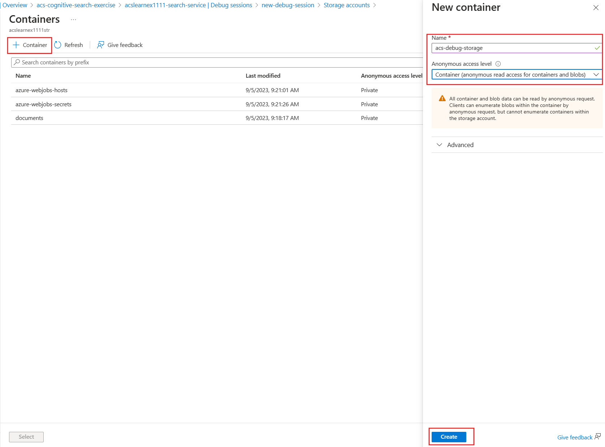

---
lab:
  title: Eseguire il debug dei problemi di ricerca
---

# Eseguire il debug dei problemi di ricerca

La soluzione di ricerca è stata creata, ma si è notato che sono presenti alcuni avvisi nell'indicizzatore.

In questo esercizio si creerà una soluzione Azure AI Search, si importeranno alcuni dati di esempio e si risolverà un avviso dell'indicizzatore.

> **Nota** Per completare questo esercizio, sarà necessaria una sottoscrizione di Microsoft Azure. Se non è ancora disponibile alcuna sottoscrizione, è possibile registrarsi per una valutazione gratuita all'indirizzo [https://azure.com/free](https://azure.com/free?azure-portal=true).

## Creare la soluzione di ricerca

Prima di iniziare a usare una sessione di debug, è necessario creare un servizio di Ricerca cognitiva di Azure.

1. [Distribuire risorse in ](https://portal.azure.com/#create/Microsoft.Template/uri/https%3A%2F%2Fraw.githubusercontent.com%2FAzure-Samples%2Fazure-search-knowledge-mining%2Fmain%2Fazuredeploy.json): selezionare questo collegamento per distribuire tutte le risorse necessarie nel portale di Azure.

    

1. In **Gruppo di risorse** selezionare **Crea nuovo**.
1. Digitare **acs-cognitive-search-exercise**.
1. Selezionare l'**area** più vicina.
1. Per **Prefisso risorsa** immettere **acslearnex** e aggiungere una combinazione casuale di numeri o caratteri per assicurarsi che il nome archiviazione sia univoco.
1. In Località selezionare la stessa area usata in precedenza.
1. Nella parte inferiore del riquadro selezionare **Rivedi e crea**.
1. Attendere la distribuzione della risorsa e quindi selezionare **Vai al gruppo di risorse**.

## Importare dati di esempio

Dopo aver creato le risorse, è ora possibile importare i dati di origine.

1. Nelle risorse elencate selezionare il servizio di ricerca.

1. Nel riquadro **Panoramica** selezionare **Importa dati**.

      

1. Nel riquadro Importa data pani selezionare **Esempi** in Origine dati.

      

1. Nell'elenco degli esempi selezionare **hotels-sample**.
1. Selezionare **Avanti: Aggiungi competenze cognitive (facoltativo)**.
1. Espandere la sezione **Aggiungi arricchimenti**.

    

1. Selezionare **Competenze cognitive testo**.
1. Selezionare **Avanti: Personalizza indice di destinazione**.
1. Lasciare le impostazioni predefinite, quindi selezionare **Avanti: Crea un indicizzatore**.
1. Selezionare **Invia**.

## Usare una sessione di debug per risolvere gli avvisi dell'indicizzatore

L'indicizzatore ora inizierà a inserire 50 documenti. Se tuttavia si controlla lo stato dell'indicizzatore, si noterà che sono presenti degli avvisi.

1. Selezionare **Debug sessioni** nel riquadro sinistro.

1. Selezionare **+ Aggiungi sessione di debug**.

1. Selezionare **Scegli una connessione esistente** per Stringa di connessione archiviazione, quindi selezionare l'account di archiviazione.

    
1. Selezionare **+ Contenitore** per aggiungere un nuovo contenitore. Denominarlo **acs-debug-storage**.

    

1. Impostare il **livello di accesso anonimo** su **Contenitore (accesso in lettura anonimo per contenitori e BLOB)**.

    > **Nota**: Potrebbe essere necessario abilitare BLOB anonimi per selezionare questa opzione. A tale scopo, nell'account di archiviazione passare a **Configurazione**, impostare **Consenti accesso anonimo BLOB** su **Abilitato**, quindi selezionare **Salva**.

1. Seleziona **Crea**.
1. Selezionare il nuovo contenitore nell'elenco, quindi scegliere **Seleziona**.
1. Selezionare **hotel-sample-indexer** per il **modello indicizzatore**.
1. Selezionare **Salva sessione**.

    Il grafo delle dipendenze mostra che per ogni documento è presente un errore su tre competenze.
    

1. Selezionare **V3**.
1. Nel riquadro dei dettagli delle competenze selezionare **Errori/Avvisi(1)**.
1. Espandere la colonna **Messaggio** per poter visualizzare i dettagli.

    I dettagli sono:

    *Codice lingua non valido '(Sconosciuto)'. Lingue supportate: ar,cs,da,de,en,es,fi,fr,hu,it,ja,ko,nl,no,pl,pt-BR,pt-PT,ru,sv,tr,zh-Hans. Per altri dettagli, vedere https://aka.ms/language-service/language-support.*

    Se si esamina il grafo delle dipendenze, la competenza Rilevamento lingua presenta output verso le tre competenze con avvisi. Anche l'input della competenza che causa l'errore è `languageCode`.

1. Nel grafo delle dipendenze selezionare **Rilevamento lingua**.

    
    Esaminando il codice JSON delle impostazioni della competenza, si noti che il campo usato per dedurre la lingua è `HotelId`.

    Questo campo causerà l'errore perché la competenza non riesce a determinare la lingua in base a un ID.

## Risolvere l'avviso dell'indicizzatore

1. Selezionare l’**origine** in Input e modificare il campo in `/document/Description`.
    
1. Seleziona **Salva**.
1. Selezionare **Esegui**.

    

    L'indicizzatore non dovrebbe più presentare errori o avvisi. Il set di competenze ora può essere aggiornato.

1. Selezionare **Commit delle modifiche**.

    
1. Seleziona **OK**.

1. A questo punto è necessario assicurarsi che il set di competenze sia collegato a una risorsa di Servizi di Azure AI. In caso contrario, si raggiungerà la quota di base e l'indicizzatore raggiungerà il timeout. A tale scopo, selezionare **Set di competenze** nel riquadro sinistro, quindi selezionare **hotels-sample-skillset**.

    
1. Selezionare **Connetti Servizio IA**, quindi selezionare la risorsa servizi di IA nell'elenco.

    
1. Seleziona **Salva**.

1. Eseguire ora l'indicizzatore per aggiornare i documenti con gli arricchimenti IA corretti. A tale scopo, selezionare **Indicizzatori** nel riquadro sinistro, selezionare  **hotels-sample-indexer**, quindi selezionare **Esegui**.  Al termine dell'esecuzione, si noterà che ora gli avvisi sono pari a zero.

    

### Eliminazione

 Ora che l'esercizio è stato completato, se non è più necessario esplorare i servizi di Azure AI Search, eliminare le risorse di Azure create durante l'esercizio. Il modo più semplice consiste nell'eliminare il gruppo di risorse **acs-cognitive-search-exercise**.
