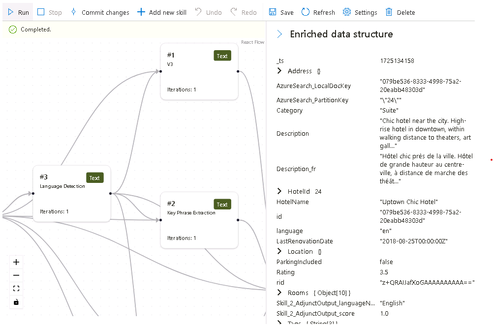

---
lab:
  title: Eseguire il debug dei problemi di ricerca
---

# Eseguire il debug dei problemi di ricerca

La soluzione di ricerca è stata creata, ma si è notato che sono presenti alcuni avvisi nell'indicizzatore.

In questo esercizio si creerà una soluzione Azure AI Search, si importeranno alcuni dati di esempio e si risolverà un avviso dell'indicizzatore.

> **Nota** Per completare questo esercizio, sarà necessaria una sottoscrizione di Microsoft Azure. Se non è ancora disponibile alcuna sottoscrizione, è possibile registrarsi per una valutazione gratuita all'indirizzo [https://azure.com/free](https://azure.com/free?azure-portal=true).

## Creare la soluzione di ricerca

Prima di iniziare a usare una sessione di debug, è necessario creare un servizio di Azure AI Search.

1. [Distribuire le risorse in Azure](https://portal.azure.com/#create/Microsoft.Template/uri/https%3A%2F%2Fraw.githubusercontent.com%2FMicrosoftLearning%2Fmslearn-knowledge-mining%2Fmain%2FLabfiles%2F08-debug-search%2Fazuredeploy.json): se ci si trova in una VM ospitata, copiare questo collegamento e incollarlo nel browser della VM. Altrimenti, selezionare questo collegamento per distribuire tutte le risorse necessarie nel portale di Azure.

    

1. In **Gruppo di risorse** selezionare il gruppo di risorse fornito o selezionare **Crea nuovo** e digitare **debug-search-exercise**.
1. Selezionare l'**area** più vicina o usare l'impostazione predefinita.
1. Per **Prefisso risorsa** immettere **debugsearch** e aggiungere una combinazione casuale di numeri o caratteri per assicurarsi che il nome archiviazione sia univoco.
1. In Località selezionare la stessa area usata in precedenza.
1. Nella parte inferiore del riquadro selezionare **Rivedi e crea**.
1. Attendere la distribuzione della risorsa e quindi selezionare **Vai al gruppo di risorse**.

## Importare dati di esempio e configurare le risorse

Dopo aver creato le risorse, è ora possibile importare i dati di origine.

1. Nelle risorse elencate passare all'account di archiviazione. Nel riquadro a sinistra passare a **Configurazione**, impostare **Consenti accesso anonimo BLOB** su **Abilitato**, quindi selezionare **Salva**.
1. Tornare al gruppo di risorse e selezionare il servizio di ricerca.
1. Nel riquadro **Panoramica** selezionare **Importa dati**.

      

1. Nel riquadro Importa data pani selezionare **Esempi** in Origine dati.

      

1. Nell'elenco degli esempi selezionare **hotels-sample**.
1. Selezionare **Avanti: Aggiungi competenze cognitive (facoltativo)**.
1. Espandere la sezione **Aggiungi arricchimenti**.

    

1. Selezionare **Competenze cognitive testo**.
1. Selezionare **Avanti: Personalizza indice di destinazione**.
1. Lasciare le impostazioni predefinite, quindi selezionare **Avanti: Crea un indicizzatore**.
1. Selezionare **Invia**.

## Usare una sessione di debug per risolvere gli avvisi dell'indicizzatore

L'indicizzatore ora inizierà a inserire 50 documenti. Se tuttavia si controlla lo stato dell'indicizzatore, si noterà che sono presenti degli avvisi.

1. Selezionare **Debug sessioni** nel riquadro sinistro.
1. Selezionare **+ Aggiungi sessione di debug**.
1. Specificare un nome per la sessione e selezionare **hotel-sample-indexer** per il **Modello di indicizzatore**.
1. Selezionare l'account di archiviazione dal campo **Account di archiviazione**. Verrà creato automaticamente un contenitore di archiviazione per i dati di debug.
1. Lasciare deselezionata la casella di controllo per l'autenticazione con un'identità gestita.
1. Seleziona **Salva**.
1. Dopo la creazione, la sessione di debug verrà eseguita automaticamente sui dati nel servizio di ricerca. Dovrebbe essere completata con errori/avvisi.

    Il grafo delle dipendenze mostra che per ogni documento è presente un errore su tre competenze.
    

    > **Nota**: è possibile che venga visualizzato un errore relativo alla connessione all'account di archiviazione e alla configurazione delle identità gestite. Ciò si verifica se si tenta di eseguire il debug troppo rapidamente dopo l'abilitazione dell'accesso BLOB anonimo e l'esecuzione della sessione di debug dovrebbe comunque funzionare. L'aggiornamento della finestra del browser dopo alcuni minuti dovrebbe rimuovere l'avviso.

1. Nel grafo delle dipendenze selezionare uno dei nodi delle competenze con un errore.
1. Nel riquadro dei dettagli delle competenze selezionare **Errori/Avvisi(1)**.

    I dettagli sono:

    *Codice della lingua non valido '(Sconosciuto)'. Lingue supportate: af,am,ar,as,az,bg,bn,bs,ca,cs,cy,da,de,el,en,es,et,eu,fa,fi,fr,ga,gl,gu,he,hi,hr,hu,hy,id,it,ja,ka,kk,km,kn,ko,ku,ky,lo,lt,lv,mg,mk,ml,mn,mr,ms,my,ne,nl,no,or,pa,pl,ps,pt-BR,pt-PT,ro,ru,sk,sl,so,sq,sr,ss,sv,sw,ta,te,th,tr,ug,uk,ur,uz,vi,zh-Hans,zh-Hant. Per altri dettagli, vedere https://aka.ms/language-service/language-support.*

    Se si esamina il grafo delle dipendenze, la competenza Rilevamento lingua presenta output verso le tre competenze con errori. Se si esaminano le impostazioni della competenza con errori, si noterà che l'input della competenza che causa l'errore è `languageCode`.

1. Nel grafo delle dipendenze selezionare **Rilevamento lingua**.

    
    Esaminando il codice JSON delle impostazioni della competenza, si noti che il campo usato per dedurre la lingua è `HotelId`.

    Questo campo causerà l'errore perché la competenza non riesce a determinare la lingua in base a un ID.

## Risolvere l'avviso dell'indicizzatore

1. Selezionare l’**origine** in Input e modificare il campo in `/document/Description`.
1. Seleziona **Salva**.
1. Selezionare **Esegui**. L'indicizzatore non dovrebbe più presentare errori o avvisi. Il set di competenze ora può essere aggiornato.

    
   
1. Selezionare **Esegui commit delle modifiche** per eseguire il push delle modifiche apportate in questa sessione all'indicizzatore.
1. Seleziona **OK**. È ora possibile eliminare la sessione.

A questo punto è necessario assicurarsi che il set di competenze sia collegato a una risorsa di Servizi di Azure AI. In caso contrario, verrà raggiunta la quota di base e l'indicizzatore farà registrare un timeout. 

1. A tale scopo, selezionare **Set di competenze** nel riquadro sinistro, quindi selezionare **hotels-sample-skillset**.

    
1. Selezionare **Connetti Servizio IA**, quindi selezionare la risorsa servizi di IA nell'elenco.

    
1. Seleziona **Salva**.

1. Eseguire ora l'indicizzatore per aggiornare i documenti con gli arricchimenti IA corretti. A tale scopo, selezionare **Indicizzatori** nel riquadro sinistro, selezionare  **hotels-sample-indexer**, quindi selezionare **Esegui**.  Al termine dell'esecuzione, si noterà che ora gli avvisi sono pari a zero.

    

## Eliminazione

 Ora che l'esercizio è stato completato, se non è più necessario esplorare i servizi di Azure AI Search, eliminare le risorse di Azure create durante l'esercizio. Il modo più semplice consiste nell'eliminare il gruppo di risorse **debug-search-exercise**.
