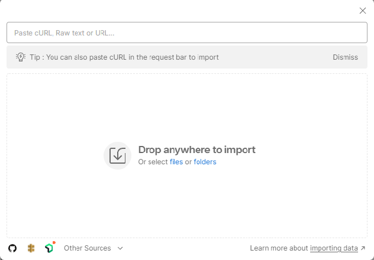

---
lab:
  title: Usare l'API REST per eseguire query di ricerca vettoriali
---

# Usare l'API REST per eseguire query di ricerca vettoriali

In questo esercizio si configurerà il progetto, si creerà un indice, si caricheranno i documenti e si eseguiranno query.

Per eseguire correttamente questo esercizio, è necessario quanto segue:

- L'[app Postman](https://www.postman.com/downloads/)
- Una sottoscrizione di Azure
- Servizio Azure AI Search
- La raccolta di campioni Postman che si trova in questo repository: *Vector-Search-Quickstart.postman_collection json v1.0*.

> **Nota** È possibile trovare altre informazioni sull'app Postman [qui](https://learn.microsoft.com/en-us/azure/search/search-get-started-rest), se necessario.

## Impostare il progetto

Per prima cosa configurare il progetto eseguendo i passaggi seguenti:

1. Prendere nota di **URL** e **Chiave** dal servizio Azure AI Search.

    

1. Scaricare la raccolta di campioni [Postman](https://github.com/MicrosoftLearning/mslearn-knowledge-mining/blob/main/Labfiles/10-vector-search/Vector%20Search.postman_collection%20v1.0.json).
1. Aprire Postman e importare la raccolta selezionando il pulsante **Importa** e trascinare e rilasciare la cartella della raccolta nella casella.

    

1. Selezionare il pulsante **Fork** per creare una fork della raccolta e aggiungere un nome univoco.
1. Fare clic con il pulsante destro del mouse sul nome della raccolta e selezionare **Modifica**.
1. Selezionare la scheda **Variabili** e immettere i valori seguenti usando il servizio di ricerca e i nomi degli indici dal servizio Azure AI Search:

    

1. Salvare le modifiche selezionando il pulsante **Salva**.

È possibile inviare le richieste al servizio Azure AI Search.

## Creare un indice

Creare quindi l'indice in Postman:

1. Selezionare **Crea/aggiorna indice PUT** dal menu laterale.
1. Aggiornare l'URL con il **nome del servizio di ricerca**, il **nome dell'indice** e la **versione API** annotati in precedenza.
1. Selezionare la scheda **Corpo** per visualizzare la risposta.
1. Impostare il **nome indice** con il valore del nome dell'indice dall'URL e selezionare **Invia**.

Verrà visualizzato un codice di stato di tipo **200** che indica una richiesta con esito positivo.

## Caricare documenti

Nella richiesta Carica documenti sono inclusi 108 documenti, ognuno include un set completo di incorporamenti per i campi **titleVector** e **contentVector**.

1. Selezionare **Carica documenti POST** dal menu laterale.
1. Aggiornare l'URL con il **nome del servizio di ricerca**, il **nome indice** e la **versione API** come in precedenza.
1. Selezionare la scheda **Corpo** per visualizzare la risposta e selezionare **Invia**.

Verrà visualizzato un codice di stato di tipo **200** per indicare che la richiesta ha avuto esito positivo.

## Eseguire query

1. Provare ora a eseguire le query seguenti nel menu laterale. A tale scopo, assicurarsi di aggiornare l'URL ogni volta come prima e inviare una richiesta selezionando **Invia**:

    - Ricerca vettoriale singola
    - Ricerca vettoriale singola con filtro
    - Ricerca ibrida semplice
    - Ricerca ibrida semplice con filtro
    - Ricerca tra campi
    - Ricerca su più query

1. Selezionare la scheda **Corpo** per visualizzare la risposta e visualizzare i risultati.

Verrà visualizzato un codice di stato di tipo **200** per una richiesta con esito positivo.
